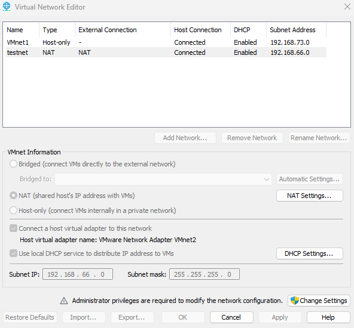
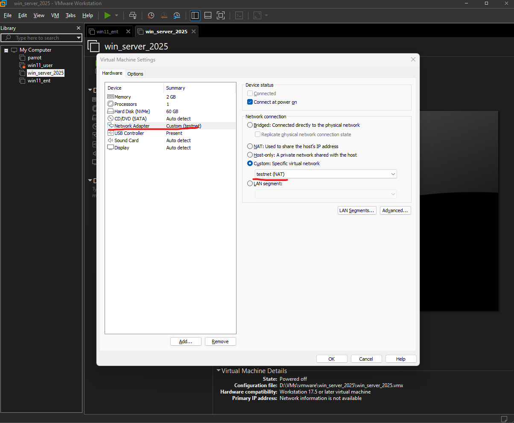
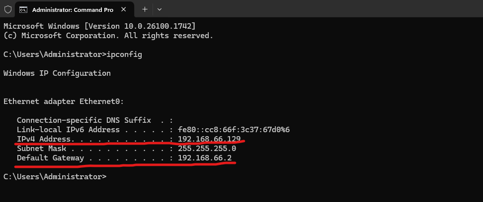

# Active Directory Home Lab Initial Setup 
This repository details the setup of a simple Active Directory Home Lab to practice AD management but can later be configured for security practicies like penetration testing.
The configuration setup is based off TCM Security's Azure Active Directory lab while this guide aims to detail a written and screenshot oriented version that can be quickly referenced using CTRL - F to find keyworded sections during the general setup.

# Tools and Software Needed
- VMware Workstation or VirtualBox / other virtualization Software
- A copy of Windows 11 Professional Edition for Work/School account connection
- A copy of Windows Server 2025

That's all that's need to get a functional lab started. 

*Note, that this is a non-secure lab for actual work purposes but an opportunity to experience actioning commands on Active Directory for entry level IT positions.

# Initial Setup Steps
First, I've created two virtual machines on VMware Workstation, the first is setup for Windows Server 2025 and the second is a Windows 11 Pro virtual machine. 
To make sure that both devices are on the same network, I've created a custom virtual network that the Win11 and WinServer can communicate on.

You can create a custom network by opening up VMWare Workstation and selecting **Edit** > **Virtual Network Editor** > **Change Settings** as this requires admin privileges > **Add Network**.

For this home lab, we'll be using a **Nat Network** so that we can maintain internet connection. Once you've created your NAT type network it should look like this:

 

 You should now have both a Windows 11 Pro and Windows 2025 Machine ready to be installed. You can load up a VM by selecting **File** > **New Virtual Machine** and follow the prompts on completing creation of the VMs.

 # Installation and Setup

 ## Install 
 Installing both Win11 and Win Server 2025 should be relatively simple and can be followed through the Windows prompts on how to set this up. 

 When installing the Windows Server and you're asked to create a built in administrator account, be sure to use a complex password that includes upper and lower case letters, numbers, and symbols as this is a requirement for certain Active Directory features. 

 Since it's relatively straight forward from here, I'll let you complete these step and be sure to take a snapshot of the freshly installed Windows Server.. backups are important!

## Windows Server 2025 Domain Controller Configuration

Let's start with the simple; **what is a domain controller?** It's a serer responsible for managing network and identity security requests. It acts as an authenticator to ensure the user making a request is authorized to access said assets and denies it when it's not mean't for that specific user. We should start by identifying our computer and changing the PC Name. You should change your PC name to something like "DC01" to identify as the first domain controller.

We should start by configuring our domain controller by installing the **Activity Directory Domain Services, Group Policy Management, Remote Server Administration Tools**. This can be completed by being in the **Dashboard** screen and selecting **Tools > Add Roles and Features**. You can follow through the prompts as by default, we should already have everything selected. Your server selection should be your PC  which if you've changed the name, should now be something like "DC01". For server roles, you can select all of the previously mentioned "**Activity Directory Domain Services, Group Policy Management, Remote Server Administration Tools**".
You should now be able to install the by continuing to press **Next** through the prompts and at **Confirmation**, be sure to select **Restart the destination server automatically if required** and install. Once this is completed, you can select **Promote this server to a domain controller**.

### Deployment Configuration
Once you've selected to promote the server to a domain controller, you can now create a **new forest** and give it a simple name for our lab. I've gone with "lab.local" to specify its my own local labratory. If you own your own domain and configuring an enterprise setup, you can use a real domain like "sample.com" or "sample.ca".
The next settings can all be left as default but will need a Directory Services Restore Mode password to be set. Set a complex password for this. The remain settings can be left as default and can continue to press next till the **Prerequisites check** which will take a minute and prompt to install further. Press install and the server should automatically reinstall.
You should now see your new administrator account active which you can log into it. 

To finish our configuration, we'll add the **Active Directory Certificates Services**. You can select **Manage > Add Roles and Features > Next > Next** which should take you to **Server Roles**. Select **Active Directory Certificate Services** and select install. 
Once the install has finished, there should be a **Configure Active Directory Certificate Services on the destination server** which can be selected. The credentials can be left as default and under **Role Services**, select **Certification Authority** and leave the rest as default and select **Next** till **Configure** to complete configuring the domain controller.

## Creating Domain Users 
You can access the Domain Users configuration setup through selecting **Tools > Active Directory Users and Computers** which opens our directory for users/computers. You should also see our Lab.local domain that we created which is our management platform. If you've set another name instead of lab.local, you'll instead see your chosen input. 
To simplify our processes and workflow, we can create a new folder or **organizational unit** by right clicking the file tree and selecting **New > Organizational unit** and we can title it **Groups**. Under **Users**, we can drag all of the groups over to our groups folder. These groups can be identified by noticing the Person icon beside the name, has two people instead of one, indicating it as a group. What's left over should be the Domain Admin account and a guest user.

To make a new user, you can right click the main area and select **New > User**. You can name the user's first/last name whatever you want and as a normal login schema, we can do firstname.lastname @lab.local for our User logon name. This will be what our user uses to log in to their account with. Select **Next** and create a randomly generated password as best security practicies and select the box **User must change password at next logon**. Select **Next > Finish** and that will be the first employee account! We'll leave it at one profile for now and can later iterate with more profiles at a later time.

From here, we'll need to link these Active Directory users to an actual windows PC (in this case, a windows VM) which we'll complete next.

## Attaching Windows to the Domain Controller
With our already created network and installed Windows 11 Pro edition (for work/school accounts), and our Windows 2025 Server, make sure BOTH virtual machines are running. We'll need to configure the network to a static IP address.

*On the Server*
Open **CMD** and type **ipconfig** and hit enter. It should look like this in the image below:

I've highlighted the important sections we need from this command in red but you'll need to use your own Ipv4 and default gateway that your network provides. To set a static IP address, you can right click your internet connection icon on your taskbar and select **Network & Internet settings > Advanced Network Settings > Select your connected internet (most likely Ethernet0 if a VM) > More adapter options and edit > Internet Protocol Version 4 (TCP/IPv4)**. 
Select **Use the Following IP Address > and add your IPv4 Address from Ipconfig to IP Address, Subnet Mask to 255.255.255.0 and Default gateway to the same default gateway provided in ipconfig**. You can then select **use the following DNS server addressess: > and for Preferred DNS server to 127.0.0.1 for local and 8.8.8.8 for Alternate DNS server for Google's public DNS**.

*On the User PC*
On the user PC once signed in, you can also run the ipconfig command to get the configuration of the user pc and set a static IP address on it as well. Use the same steps to access your IPv4 Settings  **Network & Internet settings > Advanced Network Settings > Select your connected internet (most likely Ethernet0 if a VM) > More adapter options and edit > Internet Protocol Version 4 (TCP/IPv4)**. 
The **difference in this configuration** is that you can leave the **obtain IP address automatically** as default and select the **use the following DNS Server addressess** and set the **Preferred DNS Server** to your Server's IPv4 Address and Alternative DNS Server to Google's 8.8.8.8 

This will allow internet connection to continue while also connecting to the domain. 

You can now search in the taskbar **Access Work or School** to connect to the active directory setup. For your **Domain Name**, you can simply enter the domain setup earlier (mine is lab.local), sign in as the administrator and set this profile as a standard user. 

Restarting the PC, you should now see Lab\Administrator (if your domain is called lab) along with other user where you can now login using the user created in the previous step following the naming schema of firstname.lastname and our randomly set password that the user will be prompted to reset upon login.

## Completed! 
With this step completed, your domain controller should now be active and functional with a user profile attached to it. This can later be configured further to create sub groups like having an IT, engineering, client services, etc departments and generating new user profiles with different sets of permissions and access to different resources which will be created in another guide as the depth of account setup is a deeper and more advanced procedure following zero trust policies to ensure security. You can now feel free to manage your own server and practice technical IT maintanence and configurations from here on. 

### Acknowledgements
This is largely based of the video lab developed by TCM Security with slight modifications and in written format. TCM Security can be found at https://tcm-sec.com/. 

Documentation referenced is the Active Directory documentation by Microsoft which can be found at https://learn.microsoft.com/en-us/troubleshoot/windows-server/active-directory/active-directory-overview